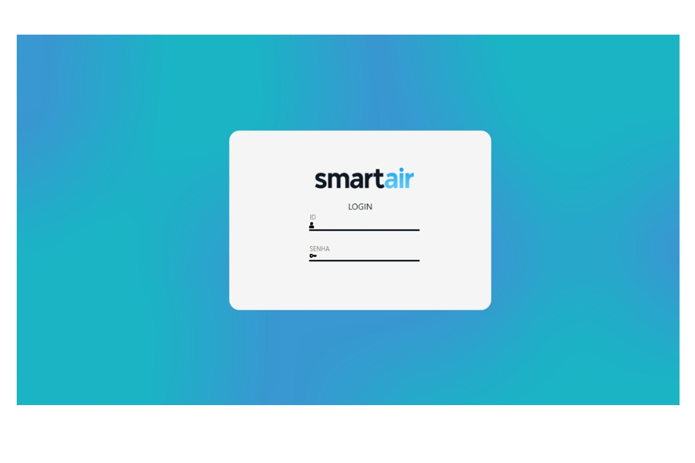

# ❄️ Identidade Visual — SmartAir

Projeto de **identidade visual** desenvolvido para o **SmartAir — Sistema de Gerenciamento de Ares-Condicionados à Distância**, com foco em criar uma personalidade visual clara, funcional e coerente com a proposta tecnológica do sistema.

O trabalho envolve desde a concepção conceitual da marca até a aplicação prática da identidade em interface digital.

---

## 📌 Informações Gerais

- **Projeto:** SmartAir
- **Tipo de projeto:** Identidade Visual
- **Segmento:** Tecnologia / Sistemas de Gerenciamento
- **Ano:** 2024

---

## 🎯 Contexto e Motivação

Mesmo em projetos onde o design não é um requisito obrigatório, acredito que uma **identidade visual bem definida agrega valor**, profissionalismo e clareza à solução desenvolvida.

Por isso, me propus a criar uma identidade visual completa para o SmartAir, buscando:
- Dar **personalidade e charme** ao sistema  
- Traduzir visualmente a proposta de **controle remoto de ar-condicionado**  
- Criar uma base sólida para futuras expansões do projeto  

Este trabalho demonstra a aplicação do design como elemento estratégico, mesmo em sistemas técnicos.

---

## 🎨 Desenvolvimento da Identidade Visual

A identidade visual do SmartAir foi construída a partir de decisões conceituais alinhadas à ideia central do projeto.

### 🎨 Paleta de Cores
Foram escolhidos **tons de azul**, remetendo diretamente a:
- Ar-condicionado
- Climatização
- Tecnologia
- Sensação de frescor e controle

---

### ☁️ Ícone do Sistema
O ícone foi desenvolvido a partir da **estilização de uma nuvem**, simbolizando:
- Controle remoto
- Tecnologia em nuvem
- Climatização e ar

O objetivo foi criar um símbolo simples, memorável e funcional para uso em interfaces digitais.

---

### 🔤 Tipografia Personalizada
A tipografia foi desenvolvida com foco em:
- Legibilidade
- Modernidade
- Impacto visual

Ela foi pensada para reforçar a identidade tecnológica do SmartAir, mantendo equilíbrio entre estética e funcionalidade.

---

### 🌗 Variações de Tema (Claro e Escuro)
Foram desenvolvidas **duas versões da logo**, garantindo consistência visual em diferentes contextos de uso:
- Tema claro
- Tema escuro

Essa abordagem permite melhor adaptação da identidade em interfaces e ambientes distintos.

---

## 🖥️ Aplicação em Interface — Página de Login

Como forma de aplicar a identidade visual na prática, foi desenvolvido o **layout e design de uma página de login** do sistema.

Essa etapa teve como foco:
- Coerência com a identidade visual
- Clareza na comunicação
- Experiência do usuário
- Organização visual dos elementos

---

## 🛠️ Habilidades e Tecnologias Utilizadas

- **CorelDRAW**
  - Desenvolvimento da tipografia
  - Criação do ícone
  - Construção da identidade visual

- **Conceitos aplicados**
  - Definição de paleta de cores
  - Branding e identidade visual
  - Design de interface (UI)
  - Aplicação da identidade em layout funcional

---

## 📚 Considerações Finais

Este projeto reforça a importância do design como parte integrante do desenvolvimento de sistemas, mesmo quando não é um requisito inicial.

A identidade visual do SmartAir demonstra como decisões visuais bem fundamentadas podem:
- Melhorar a percepção do produto
- Tornar o sistema mais profissional
- Facilitar a comunicação com o usuário final

---

## 👨‍💻 Autor

- **Vicente Matheus Collin Pedroso**
