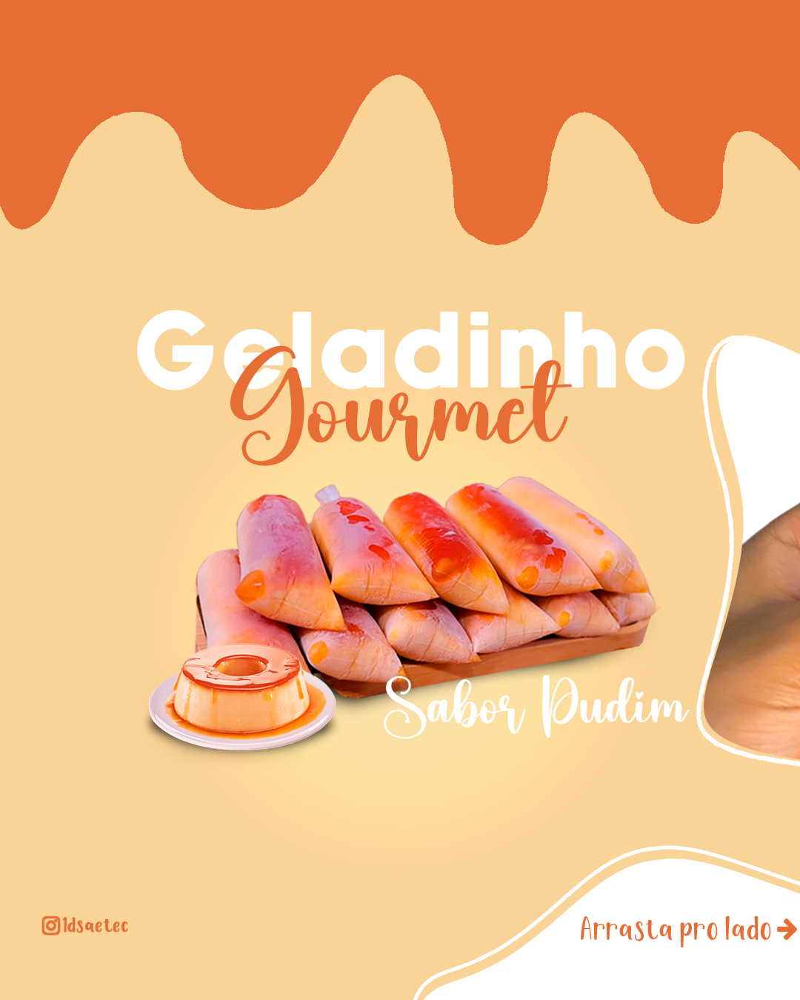
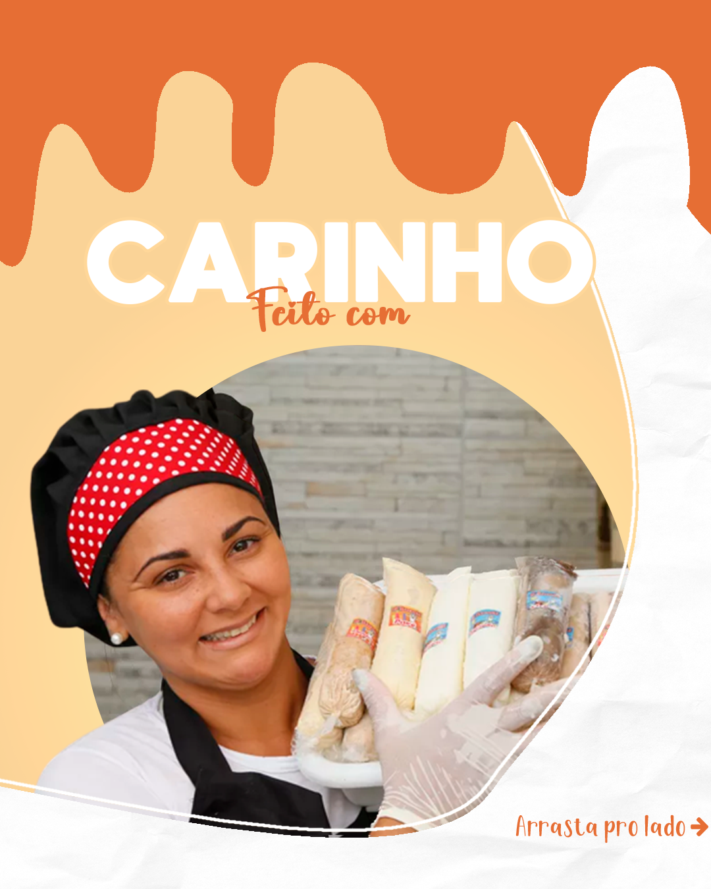
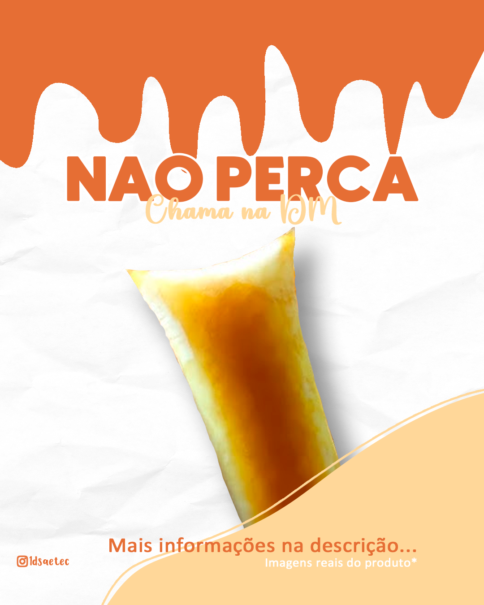
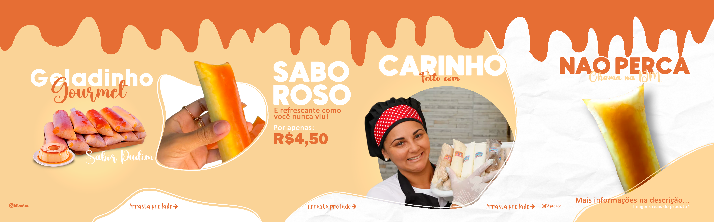

# 🍮 Social Media — Geladinho de Pudim

Projeto de **social media para feed do Instagram**, desenvolvido com o objetivo de **divulgar e vender geladinhos de pudim** em um contexto escolar, utilizando estratégias visuais atrativas e organização em formato de carrossel.

O projeto foi criado para o **Instagram da turma**, com foco em chamar atenção, despertar interesse no produto e facilitar a compreensão da proposta.

---

## 📌 Informações Gerais

- **Tipo de projeto:** Social Media
- **Plataforma:** Instagram (Feed)
- **Formato:** Carrossel
- **Quantidade de posts:** 4 artes
- **Dimensões:** 1080 x 1350 px
- **Ano:** 2024

---

## 🎯 Contexto e Objetivo

O objetivo principal do projeto foi **divulgar e impulsionar a venda** de geladinhos de pudim dentro do ambiente escolar.

Para isso, o design foi pensado para:
- Destacar visualmente o produto
- Criar uma comunicação clara e direta
- Manter unidade visual entre os posts
- Utilizar cores e tipografia alinhadas à ideia de sobremesa e doçura

O formato de carrossel foi escolhido para permitir uma apresentação progressiva e mais envolvente do conteúdo.

---

## 🖼️ Posts Individuais do Carrossel

A seguir estão os **4 posts desenvolvidos**, apresentados de forma individual para melhor visualização dos detalhes de cada arte.

### 📸 Post 1
> Introdução e chamada principal

---

### 📸 Post 2
> Destaque visual do produto

---

### 📸 Post 3
> Reforço da proposta e apelo visual

---

### 📸 Post 4
> Encerramento e incentivo à compra

---

## 🔄 Visualização do Carrossel Completo

Abaixo está a visualização do **carrossel completo**, demonstrando a coerência visual e a sequência planejada para o feed do Instagram:

---

## 🧠 Aprendizados e Conhecimentos Aplicados

Durante o desenvolvimento deste projeto, foram aplicados e aprimorados os seguintes conhecimentos:

- Busca e seleção de imagens na internet
- Recorte e tratamento de imagens
- Combinação e harmonia entre diferentes estilos tipográficos
- Criação de paleta de cores relacionada ao produto
- Desenvolvimento e organização de carrossel para Instagram
- Hierarquia visual aplicada ao marketing digital

---

## 🛠️ Tecnologias Utilizadas

  

- **Adobe Photoshop**
  - Criação das artes
  - Edição e recorte de imagens
  - Definição de cores e tipografia
  - Montagem do carrossel

---

## 📚 Considerações Finais

Este projeto demonstra a aplicação prática do design gráfico no contexto de **marketing digital e vendas**, mesmo em iniciativas simples.

A organização visual, o uso consciente de cores e a estrutura em carrossel contribuem para uma comunicação mais eficiente e atrativa no Instagram.

---

## 👨‍💻 Autor

- **Vicente Matheus Collin Pedroso**
