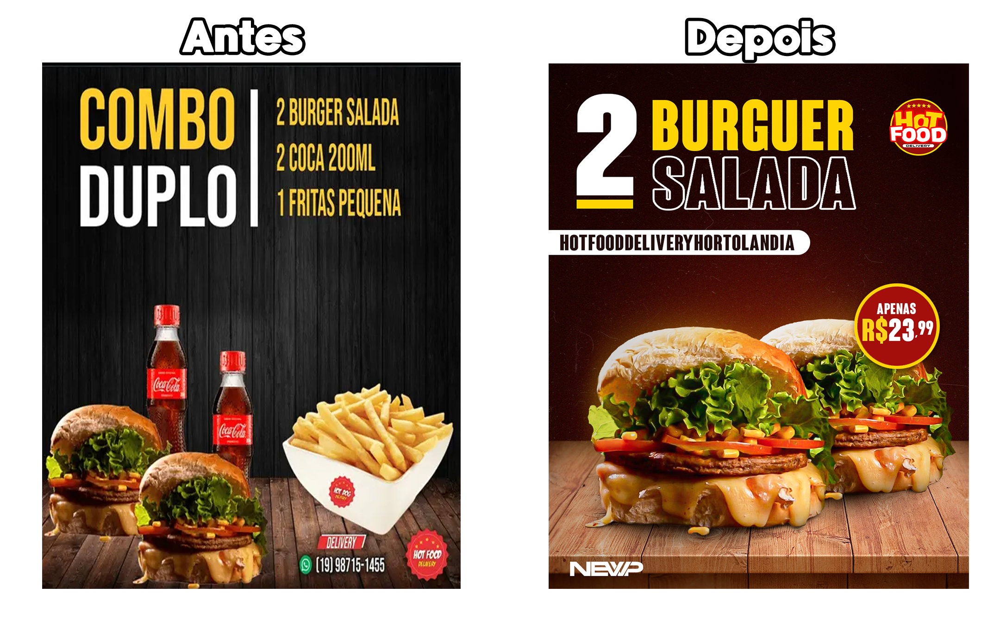

# 🍔 Social Media — Hot Food Delivery

Projeto de **social media para Instagram**, desenvolvido com o objetivo de **reimaginar e profissionalizar** a comunicação visual da hamburgueria **Hot Food Delivery**, mantendo a ideia original da marca, porém elevando a qualidade estética e estratégica do design.

---

## 📌 Informações Gerais

- **Cliente:** Hot Food Delivery (Hamburgueria)
- **Tipo de projeto:** Social Media
- **Formato:** Post para Instagram
- **Dimensões:** 1080 x 1350 px
- **Ano:** 2023

---

## 🎯 Contexto e Motivação

Ao analisar as postagens da hamburgueria, identifiquei que os conteúdos publicados apresentavam **edições visuais amadoras**, com pouco destaque para os produtos e baixo apelo visual.

Diante disso, me propus o desafio de:

- Recriar a postagem **utilizando os mesmos elementos**, como fotos, proposta e ideia original  
- Aplicar princípios de **design profissional**, hierarquia visual e tratamento de imagem  
- Tornar o hambúrguer o **elemento central da composição**, despertando mais interesse visual e apetite no público  

O foco foi demonstrar como o design pode transformar uma comunicação simples em algo mais atrativo e estratégico.

---

## 🖼️ Post Final Desenvolvido

> Versão final do post para Instagram:

---

## 🔄 Comparação Visual

Abaixo está a comparação entre a **postagem original** e a **versão recriada**, evidenciando a evolução estética e comunicacional do projeto:

**Principais melhorias aplicadas:**
- Melhor recorte e tratamento de imagem
- Ajustes de contraste e cores para valorizar o produto
- Hierarquia visual mais clara
- Comunicação mais impactante e profissional

---

## 🆕 Reimaginação da Identidade Visual

Além da postagem, também foi realizada uma **releitura da logo da hamburgueria**, buscando uma versão que:

- Chamasse mais atenção visual
- Se alinhasse melhor com o segmento gastronômico
- Transmitisse mais personalidade e força de marca

Essa proposta não substitui oficialmente a identidade original, mas serve como um **exercício criativo e estratégico de branding**.

---

## 🛠️ Ferramentas Utilizadas

  

- **Adobe Photoshop**
  - Criação da arte
  - Recorte de imagens
  - Tratamento de cores
  - Ajustes de iluminação e contraste

---

## 📚 Considerações Finais

Este projeto evidencia como decisões de design bem aplicadas podem elevar significativamente a percepção de valor de uma marca, mesmo utilizando os mesmos recursos visuais iniciais.

Trata-se de um estudo prático de **design aplicado ao marketing digital**, com foco em redes sociais e comunicação visual estratégica.

---

## 👨‍💻 Autor

- **Vicente Matheus Collin Pedroso**
