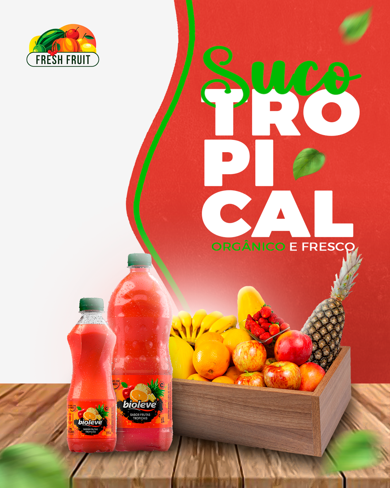

# 🧃 Social Media — Suco Tropical

Projeto de **social media desenvolvido como atividade avaliativa** para a disciplina de **Design Digital**, com foco na aplicação prática de conceitos de composição visual, tratamento de imagens e organização de layout.

A proposta consistiu na criação de uma peça gráfica para divulgação de um **suco tropical**, utilizando elementos previamente definidos.

---

## 📌 Informações Gerais

- **Tipo de projeto:** Social Media
- **Contexto:** Atividade Avaliativa — Design Digital
- **Produto:** Suco Tropical
- **Dimensões:** 1080 x 1350 px
- **Ano:** 2023

---

## 🎯 Contexto da Atividade

A atividade avaliativa tinha como objetivo testar a capacidade de aplicar conceitos fundamentais do **design digital**, utilizando obrigatoriamente os seguintes elementos fornecidos:

- Foto da garrafa de suco  
- Foto de uma caixa de frutas  
- Logo da empresa
- Uso do Slogan: Suco Tropical - Orgânico e Fresco

A partir desses elementos, o desafio foi criar uma composição visual harmoniosa, atrativa e coerente com a proposta do produto.

---

## 🎨 Desenvolvimento do Design

O design foi construído com foco em transmitir:
- Sensação de frescor
- Tropicalidade
- Atração visual para o produto

Foram aplicadas técnicas de composição e edição para integrar todos os elementos de forma equilibrada dentro do layout.

---

## 🖼️ Arte Final Desenvolvida

Abaixo está a peça final criada para a divulgação do **Suco Tropical**:

  

---

## 🧠 Conhecimentos e Técnicas Aplicadas

Durante o desenvolvimento do projeto, foram utilizados os seguintes conhecimentos:

- Recorte e tratamento de imagens
- Organização das imagens no layout
- Criação e hierarquia tipográfica
- Organização dos textos no layout
- Desenvolvimento de paleta de cores coerente com as imagens
- Uso de elementos gráficos externos para complementar o design
- Criação de iluminação e sombra artificial para dar profundidade à composição

Esses conceitos foram fundamentais para alcançar um resultado visualmente consistente e profissional.

---

## 🛠️ Tecnologia Utilizada

  

- **Adobe Photoshop**
  - Edição e recorte de imagens
  - Tratamento de cores
  - Criação de iluminação e sombras
  - Montagem e finalização do layout

---

## 📚 Considerações Finais

Este projeto representa a aplicação prática de conceitos estudados em sala de aula, demonstrando a importância do design digital na construção de peças publicitárias eficientes.

A atividade reforça a capacidade de trabalhar com **restrições criativas**, transformando elementos pré-definidos em uma composição visual coerente e atrativa.

---

## 👨‍💻 Autor

- **Vicente Matheus Collin Pedroso**
